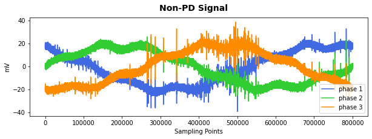

# VSB Power Line Fault Detection
Partial discharge is an electrical discharge which does not bridge the electrodes between an insulation system completely. This thesis aims to detect partial discharge patterns in voltage signals acquired from overhead power lines.As these power lines run for hundreds of miles to supply power to cities,it is really impossible manually inspect the lines for damage that doesn't immediately lead to power outage. Features are extracted from the spectograms of the voltage signals using CNN,and a phase and frequency level attention mechanism is employed to accomplish this task.Currently,a class saliency map is being implemented to find out the discriminative spectrograms regions used by CNN to detect partial discharge patterns. it will shed light on what frequency bands present in the signal at a particular time enables the model to detect the partial discharge patterns.
# Examples of PD and Non-PD signal

